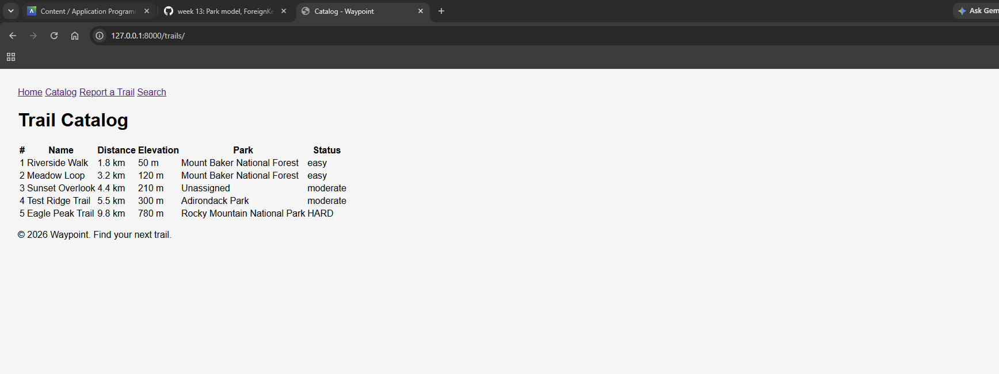
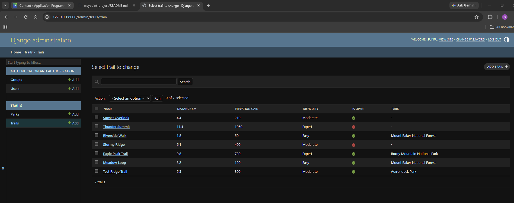

# Waypoint

A trail-finder and trip-planner built as an individual term project (Weeks 7-14).

## Setup

1. Clone the repository
2. Create and activate a virtual environment:
   \`\`\`
   python -m venv env
   env\Scripts\activate
   \`\`\`
3. Install dependencies:
   \`\`\`
   pip install -r requirements.txt
   \`\`\`
4. Run migrations:
   \`\`\`
   python manage.py migrate
   \`\`\`
5. Run the development server:
   \`\`\`
   python manage.py runserver
   \`\`\`
6. Visit http://127.0.0.1:8000/

## Environment Notes

This project originally targeted Django 4.2 (per Week 9 setup). It was upgraded to
Django 5.2 during Week 12 to fix an AttributeError in the Django admin caused by a
compatibility issue between Django 4.2 and Python 3.14. If running on an older Python
version, Django 4.2 should still work fine — the upgrade was specifically to support
Python 3.14.

## Screenshots

### Trail Catalog

### Admin
